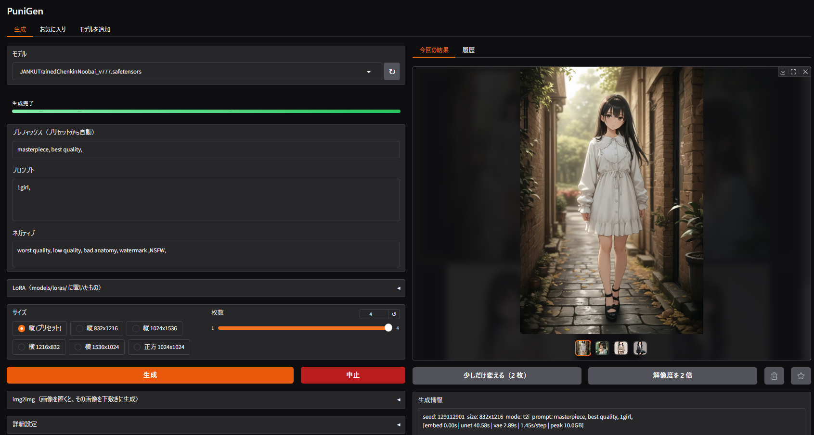
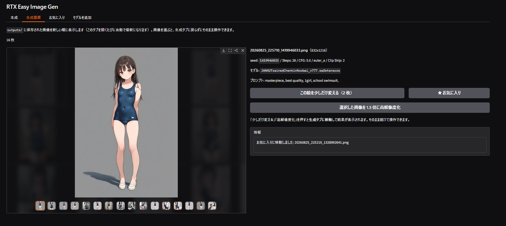

# PuniGen
PuniGen（ぷにじぇん）はdiffusers ベースの SDXL / Illustrious 系画像生成ツールです。
`setup.bat` と `start.bat` を順に実行すれば動きます。

複雑なことはできません。手元にグラボがあるからとりあえず画像生成を試してみたい方にお勧めです。
複雑なことをしたい人はComfyUIをお勧めします。

**P**uni **U**ses **N**o **I**ntricacy.

## 目次

- [スクリーンショット](#スクリーンショット)
- [主な機能](#主な機能)
- [動作環境](#動作環境)
  - [快適に動く構成](#快適に動く構成)
  - [設定による必要量の違い](#設定による必要量の違い)
  - [動くが低速な構成（CPU オフロード）](#動くが低速な構成cpu-オフロード)
- [はじめかた](#はじめかた)
  - [1. setup.bat をダブルクリック](#1-setupbat-をダブルクリック)
  - [2. start.bat をダブルクリック](#2-startbat-をダブルクリック)
  - [3. モデルを用意する](#3-モデルを用意する)
- [用語](#用語)
- [画面](#画面)
  - [生成のながれ](#生成のながれ)
  - [結果に対する操作](#結果に対する操作)
  - [プロンプトの書き方](#プロンプトの書き方)
  - [LoRA](#lora)
  - [画像から生成する（img2img）](#画像から生成するimg2img)
- [こまったら](#こまったら)
- [もっと細かい設定](#もっと細かい設定)
  - [モデルごとのプリセット](#モデルごとのプリセット)
  - [VRAM 判定](#vram-判定)
  - [生成情報の読み方](#生成情報の読み方)
  - [速度設定](#速度設定)
  - [依存パッケージを更新する](#依存パッケージを更新する)
  - [表示の大きさ](#表示の大きさ)
  - [拡大の仕組み](#拡大の仕組み)
  - [保存先とファイル名](#保存先とファイル名)
- [ライセンス](#ライセンス)

## スクリーンショット
メイン画面


モデル検索画面



## 主な機能

- Civitai の検索とダウンロードを画面内で行えます。SDXL 系以外は結果に出さないので、動かないモデルを落とす心配がありません。落としたファイルは配布元の SHA256 と照合してから一覧に出します。
- プロンプト欄で Danbooru タグを補完します。候補は投稿数の多い順です。辞書は同梱していて、実行時にネットへは接続しません。
- Civitai のプロンプトをそのまま貼れます。`(tag:1.3)` の強調と、77 トークンを超える長さに対応しています。
- LoRA を同時に 3 つまで重ねられます。強度はスライダーで、絵を見ながら動かせます。プロンプトに混ざった `<lora:名前:0.8>` はそのまま貼れば LoRA 欄へ移ります。
- 生成した絵を起点に、少しだけ変えた案を出したり、2 倍に拡大したりできます。生成履歴から後で遡ることもできます。
- 生成条件は画像そのものに埋め込まれます。履歴の絵を選ぶと、そのときのプロンプト・seed・LoRA がまるごと入力欄へ戻ります。
- モデルを読み込む前に空き VRAM を調べ、載らない場合は CPU オフロードに切り替えます。

## 動作環境

Windows と NVIDIA GeForce RTX 30 / 40 / 50 シリーズ。

標準的な SDXL は fp16 で約 6.5GB です。VRAM が 12GB あれば GPU に常駐でき、832x1216・28 ステップで 20〜30 秒ほど。8GB では重みを出し入れしながら動くので数分かかります。

### 快適に動く構成

| VRAM | GPU |
| --- | --- |
| 24GB 以上 | RTX 3090 / 3090 Ti / 4090 / 5090 |
| 16GB | RTX 4080 / 4080 SUPER / 5080 / 5070 Ti / 4070 Ti SUPER / 4060 Ti 16GB / 5060 Ti 16GB |
| 12GB | RTX 3060 12GB / 3080 12GB / 3080 Ti / 4070 / 4070 SUPER / 4070 Ti / 5070 |

推奨ラインは 12GB です。ただし生成中のピークは 9〜10GB に達するため、余裕は多くありません。ゲームや録画ソフトが VRAM を使っていると足りなくなります。生成中は閉じてください。足りない場合は CPU オフロードに切り替わります。

### 設定による必要量の違い

上の表は既定の 832x1216・1 枚が前提です。サイズと枚数を上げると必要量も増えます。以下は RTX 5070 12GB での実測値です。

| 設定 | VRAM ピーク |
| --- | --- |
| 832x1216・1 枚（既定） | 9.3GB |
| 832x1216・2 枚 | 9.6GB |
| 832x1216・4 枚 | 10.0GB |
| 1024x1536・1 枚 | 10.1GB |
| 1024x1536・2 枚 | 10.6GB |

モデルを変えても必要量はほとんど変わりません。SDXL は構造が同じで、どのモデルも fp16 で約 6.5GB になるためです。手元の 3 モデルはファイルサイズが 6.46GB と 6.62GB に分かれていましたが、読み込み後はいずれも 6.46GB でした。効果があるのはサイズと枚数の方です。

VRAM が足りないときは、枚数を 1 枚に、サイズを `縦 832x1216` にするのが最も効果があります。

### 動くが低速な構成（CPU オフロード）

| VRAM | GPU |
| --- | --- |
| 8〜10GB | RTX 3050 / 3060 8GB / 3060 Ti / 3070 / 3070 Ti / 3080 10GB<br>RTX 4060 / 4060 Ti 8GB / 5060 / 5060 Ti 8GB |

重みを 1 つずつ GPU へ出し入れするため、1 枚あたり数分かかります。

## はじめかた

### 1. `setup.bat` をダブルクリック

`uv` の導入、専用の Python 3.12 の取得、`.venv` の作成、torch などのインストールを行います。管理者権限は不要で、システムの Python には触りません。

インストールするパッケージは `requirements.lock` で推移的依存まで固定してあります。実行する時期や環境が違っても同じ構成になります。

終わると GPU の認識結果が出ます。

```
CUDA: True / NVIDIA GeForce RTX 4070
```

`CUDA: False` の場合は [こまったら](#こまったら) を見てください。やり直すときは `.venv` フォルダを消して再実行します。

### 2. `start.bat` をダブルクリック

ブラウザが自動で開きます。終了するときは、ブラウザのタブではなくコンソールウィンドウを閉じてください。

### 3. モデルを用意する

「モデルを追加」タブで検索するのが簡単です。初回だけ Civitai の API キーが必要です。[civitai.com](https://civitai.com) の Account settings → API Keys で作成し、タブ内の欄に貼って保存してください。キーは `config.local.json` に保存され、git の管理外です。

「モデルを追加」タブでは、種類を「LoRA」に切り替えると LoRA も同じように検索してダウンロードできます。保存先は自動で振り分けられます。

落としたファイルは、配布元が公表している SHA256 と照合してから一覧に出します。数 GB のダウンロードは途中で化けることがあり、壊れたモデルを読み込むと原因の分かりにくいエラーで落ちるためです。照合には 6.5GB で 4 秒ほどかかります。確かめた値は、同じ場所に `モデル名.safetensors.json` として控えます（毎回計算し直さないため）。この JSON はモデル一覧には出てきません。

手元の `.safetensors` を使う場合は `models/checkpoints/` に置きます。LoRA は `models/loras/`、Textual Inversion は `models/embeddings/` に置くと、ファイル名がそのままトリガーワードになります（どちらも SDXL 形式のみ）。

## 用語

このツールを使うときに出てくる言葉です。分からないものが出てきたらここに戻ってきてください。

**モデル（チェックポイント）**

絵柄と知識のかたまりです。これを変えると絵柄が根本から変わります。1 つ 6〜7GB あり、`models/checkpoints/` に置きます。「モデルを追加」タブから落とせます。

**SDXL / Illustrious / Pony / NoobAI**

モデルの系統です。PuniGen が扱うのは SDXL 系だけです。Illustrious・Pony・NoobAI は SDXL から派生したアニメ絵向けの系統で、同じ仕組みで動きます。別系統（Flux、SD 1.5、Anima など）のファイルは読み込めません。配布ページの「Base Model」で見分けられます。

**LoRA（ろーら）**

モデルに後付けする小さな追加ファイルです。数十〜数百MB で、絵柄・画風・特定の服装などを足せます。モデル本体を差し替えずに味付けだけ変えられるのが利点で、強度のスライダーで効き具合を調整します。`models/loras/` に置きます。

**トリガーワード**

LoRA や embedding を呼び出すための合言葉です。プロンプトに書かないと効きません。配布ページに書いてあります。

**embedding（Textual Inversion）**

単語を 1 つ新しく覚えさせる仕組みです。`lazyneg` のように、ネガティブに入れて画質を整えるものが多く出回っています。`models/embeddings/` に置くと、ファイル名がそのまま合言葉になります。

**プロンプト / ネガティブプロンプト**

描いてほしいものと、描いてほしくないものです。英単語をカンマで区切って並べます。

**seed（シード）**

最初のノイズを決める数字です。**同じ設定・同じ seed なら何度でも同じ絵が出ます。** 気に入った絵を再現したいときに使います。`-1` にすると毎回ランダムです。

**Steps（ステップ）**

描き込みの回数です。多いほど丁寧ですが時間もかかります。28 前後で足りることがほとんどです。

**CFG**

プロンプトへの忠実さです。高いほど言うとおりに描きますが、上げすぎると絵が硬くなります。5 前後が目安です。

**Sampler（サンプラー）**

ノイズの消し方の手順です。変えると絵柄が少し変わります。迷ったらプリセットのままで構いません。

**Clip Skip**

プロンプトの解釈の深さです。アニメ系のモデルは 2 が定番で、Civitai の推奨値をそのまま入れて構いません。

**VRAM（ブイラム）**

グラフィックボードが持つ専用のメモリです。モデルがここに収まるかどうかで速度が大きく変わります。ゲームや配信ソフトも使うので、生成中は閉じておくのが安全です。

**CPU オフロード**

VRAM に収まらないとき、重みを少しずつ出し入れしながら動かす方式です。動きはしますが、1 枚に数分かかります。

**img2img（あい・つー・あい）**

文章からではなく、手持ちの画像を下敷きにして描き直す方式です。

**safetensors**

モデルや LoRA の保存形式です。読み込むだけで悪さをされない形式で、PuniGen はこれしか扱いません。

**Civitai（シビットエーアイ）**

モデルや LoRA が配布されているサイトです。ダウンロードには無料のアカウントと API キーが要ります。

## 画面

タブは 3 つあります。一覧は開くたびに自動で最新になります。

| タブ | 内容 |
| --- | --- |
| 生成 | プロンプトを書いて生成します。左が操作、右が結果です |
| お気に入り | 残したい絵を集めた場所です |
| モデルを追加 | Civitai を検索してダウンロードします。チェックポイントと LoRA を切り替えられます |

生成タブの右側は「今回の結果」と「履歴」のサブタブに分かれています。履歴には `outputs/` の画像が新しい順に並び、過去の絵を選んでそのまま作り直せます。

履歴の画像を選ぶと、その絵の条件が生成情報欄に出るのに加えて、プロンプト・ネガティブ・Steps・CFG・Sampler・Clip Skip・seed・サイズ・LoRA が左の入力欄へ戻ります。そのまま生成を押せば同じ絵が出ますし、一部だけ直して作り直すこともできます。

### 生成のながれ

1. モデルを選ぶと、そのモデル用のプリセットが各欄に入ります
2. プロンプトを書きます（例：`1girl, solo, looking at viewer`）
3. 生成を押します

生成中は進捗バーに step 数が出ます。気に入らなければ中止で打ち切れます。完成すると `outputs/` に自動保存されます。

### 結果に対する操作

ギャラリーで画像を選ぶと、3 つのボタンが使えます。

| ボタン | 動作 |
| --- | --- |
| 少しだけ変える | seed を保ったまま、少しだけ違う絵を 2 枚出します |
| 解像度を 2 倍 | 元の絵柄のまま拡大します（832x1216 → 1664x2432）。約 1.5 秒 |
| ★ | お気に入りの追加と解除。追加すると `favorites/` へ移動し、`outputs/` を整理しても残ります |

★ ボタンは押すたびに追加と解除が切り替わります。未登録のときは輪郭だけの星、登録済みのときは塗りつぶした星になります。解除すると画像は `outputs/` に戻るので、履歴からまた選べます。

ボタンは 1 組だけで、「今回の結果」と「履歴」のうち開いている側の画像に作用します。履歴の絵に対して実行すると、自動的に「今回の結果」へ切り替わって結果が出ます。

生成した画像には、プロンプト・ネガティブ・seed・Steps・CFG・Sampler・Clip Skip・サイズ・モデル名・使った LoRA が PNG に埋め込まれます。履歴から作り直したり、条件を入力欄へ戻したりできるのはこのためです。

この情報が無い画像（この機能より前に作ったもの、外部から持ってきたもの）を選んだときは、入力欄には一切触りません。打ちかけのプロンプトを、素性の分からない画像で消してしまわないためです。この場合はお気に入りへの移動だけできます。

### プロンプトの書き方

Civitai やモデル配布ページのプロンプトをそのまま貼れます。

- 強調は `(school swimsuit:1.3)` で強く、`[tag]` で弱くなります
- 77 トークンを超えるプロンプトも分割して全部渡します
- 入力中にタグ候補が出ます。`↑` `↓` で選び `Enter` で挿入します
- タグ名に含まれる括弧はエスケープが必要です（`fate \(series\)`）。補完から挿入すれば自動で付きます

強調構文が効くのは Clip Skip 2 のときです。Clip Skip は A1111 や Civitai の表示と同じ意味なので、配布ページの推奨値をそのまま入れて構いません。

### LoRA

`models/loras/` に置いた `.safetensors` が「LoRA」欄に並びます。同時に使えるのは 3 つまでです。

強度は 0〜1.5、既定は 0.8 です。**強度を変えるだけならモデルの読み直しは起きません**。ファイルは載せたまま重みだけ差し替えるので、スライダーを動かして絵の変化を見比べられます。

Civitai のプロンプトに混ざる `<lora:名前:0.8>` は、プロンプト欄に貼るとそのまま LoRA 欄へ移り、その部分だけがプロンプトから消えます。トリガーワードなど他の語はそのまま残ります。

上限が 3 なのは VRAM の都合ではありません。4 つ以上を重ねると効果が互いに混ざり、どのスライダーがどの変化に効いているのかを追えなくなるためです。大きな GPU を積んでも上限は変わりません。

使えるのは **SDXL 系の LoRA だけ**です。他の構造のモデル用（Flux、SD 1.5、Anima、Z-Image など）を置くと、当てる先が無いことを読み込む前に見分けて「〜用の LoRA のようです」と表示します。生成はその LoRA を外したまま続きます。

トリガーワードの自動補完はありません。配布ページに書かれている語は、プロンプトに自分で書いてください。

### 画像から生成する（img2img）

「img2img」に画像を置くと、その画像を下敷きにした生成に切り替わります。専用のボタンはなく、画像があれば i2i、空なら txt2img です。

PuniGen で作った画像を置いた場合は、その画像に埋め込まれた生成条件も左の入力欄へ戻ります（履歴から選んだときと同じ動作です）。条件を持たない画像なら、入力欄はそのままです。

結果を左右するのは変化の強さです。0.3〜0.45 で塗り直し、0.5〜0.7 で大きく描き直し、0.85 以上は元画像がほぼ参考程度になります。実際のステップ数は `Steps × 変化の強さ` です。強さ 0.4 で Steps 30 なら 12 ステップになります。

## こまったら

**`CUDA: False` と出る、または生成時に CUDA エラー**

`.venv` を消して `setup.bat` を再実行してください。NVIDIA ドライバが古い場合は更新が必要です（50 系は CUDA 12.8 対応ドライバが必須）。

**生成が異常に遅い、進捗バーが動かない**

まずステータスが `cpu offload` になっていないか確認してください。`gpu` なのに遅い場合は、VRAM があふれてシステムメモリに退避しています。GPU 使用率が 100% なのに消費電力が上がらないのが目印です。VRAM を使う他のアプリ（ゲーム、配信・録画ソフト）を閉じてください。

**モデル一覧が空**

`models/checkpoints/` に `.safetensors` があるか確認し、↻ を押してください。

**モデルをダウンロードできない**

API キーの設定を確認してください。401 は失効か入力ミス、403 は早期アクセスなどで配布されていないモデルです。通信が切れた場合は、もう一度押せば続きから再開します。

**「ダウンロードしたファイルが壊れています」と出る**

通信の途中で中身が化けています。壊れたものは自動で削除してあるので、もう一度ダウンロードしてください。繰り返し出る場合は回線か保存先ディスクを疑ってください。

**LoRA が一覧に出ない、選んでも効かない**

`models/loras/` に `.safetensors` が入っているか確かめ、「一覧を更新」を押してください。名前の下に理由が出ていれば、その内容に従ってください。よくあるのは SDXL 系でない LoRA を置いている場合です。

読み込めた場合でも、テキストエンコーダ側の重みを持つ LoRA では「一部だけ適用しました」と出ることがあります。UNet 側だけが当たった状態で、絵には効きますが、配布元の想定より効き方が弱くなることがあります。

**embedding が効かない**

コンソールに `[skip] ...` が出ていないか確認してください。SD1.5 用の embedding は SDXL では使えません。

## もっと細かい設定

<details>
<summary>開いて読む（プリセット / VRAM 判定 / 生成情報の読み方 など）</summary>

### モデルごとのプリセット

`presets/` にチェックポイント名と同じ名前の JSON を置くと、そのモデルを選んだときに設定が入ります。無ければ `_default.json` が使われます。個別の JSON は上書きマージされるので、変えたいキーだけ書けば済みます。

```json
{
  "steps": 30,
  "cfg": 5.0,
  "sampler": "euler_a",
  "clip_skip": 2,
  "size": [1024, 1536],
  "prefix_pos": "masterpiece, best quality, ",
  "default_neg": "worst quality, low quality, bad anatomy, watermark"
}
```

`prefix_pos` はプロンプト先頭に足される品質タグ、`default_neg` はネガティブ欄の初期値です。

### VRAM 判定

読み込む前に safetensors のヘッダだけを見て fp16 換算の重みサイズを測り、そのときの空き VRAM と突き合わせて配置を決めます。載らないモデルは待たされずに弾かれます。

| 状況 | 判定 | 挙動 |
| --- | --- | --- |
| 重み全体 + 作業領域が収まる | gpu | VRAM に常駐します。高速です |
| UNet + 作業領域なら収まる | cpu offload | 1 つずつ GPU へ出し入れします。低速ですが動きます |
| それも無理 | エラー | 必要量を表示して中止します |

総容量ではなく空きを見るのは、Windows では VRAM が足りなくてもエラーにならず、あふれた分をシステムメモリへ退避させるためです。そうなると数十倍遅くなり、進捗バーが止まったように見えます。

空きの値は `torch` と `nvidia-smi` の両方を見て、小さい方を使います。Windows では `torch` が報告する空きに他のプロセスの確保が反映されず、ゲームや配信ソフトが VRAM を掴んでいてもこの判定を素通りしてしまうためです。実測では、他のプロセスが 3GB 掴んだ状態で常駐と判定させると、1 枚あたり 18.7 秒が 468.6 秒（25 倍）まで落ちました。`nvidia-smi` が使えない環境では `torch` の値だけで判定します。

LoRA を選んでいる場合は、その実ファイルのサイズも重みに足して判定します。

調整するには `engine.py` の `ACTIVATION_HEADROOM_GB`（既定 2.5、常駐判定の余裕）と `OFFLOAD_HEADROOM_GB`（既定 1.5）を変えます。

### 生成情報の読み方

生成情報の最後の行に工程別の実測が出ます。LoRA を使っているときは、その上に効かせた LoRA と強度が入ります。

```
seed: 1234567890  size: 832x1216  mode: gpu  prompt: masterpiece, best quality, 1girl, ...
lora: add-detail-xl(0.8)
[embed 0.05s | unet 9.10s | vae 0.41s | 0.33s/step | peak 9.8GB]
```

`embed` はテキストエンコードで、同じプロンプトの 2 回目以降はキャッシュが効いてほぼ 0 になります。`unet` が生成本体、`vae` が画像化、`peak` は VRAM 予約のピークです。`⚠ VRAM 上限付近` が出たら退避で激遅になる寸前なので、枚数やサイズを下げてください。

同じ seed と設定で再実行した場合は、再計算せず前回の結果を返します。

### 速度設定

`engine.py` の `USE_FUSE_QKV` は既定で `False` です。QKV 融合は重みを 1GB 以上増やすため、12GB クラスでは VRAM があふれて逆に遅くなります。RTX 5070 で 0.9 秒/step から 51 秒/step まで悪化することを確認しています。VRAM 16GB 以上でのみ試す価値があります。

### 依存パッケージを更新する

直接依存は `requirements.in`、実際にインストールされるのは推移的依存まで固定した `requirements.lock` です。バージョンを上げたいときは `requirements.in` を編集してから、次のコマンドでロックを作り直します。

```
uv pip compile requirements.in -o requirements.lock ^
  --index-strategy unsafe-best-match ^
  --extra-index-url https://download.pytorch.org/whl/cu128
```

`--extra-index-url` は torch を CUDA 12.8 ビルドで取るために必要です。これを省くと `+cu128` の付かない汎用ビルドに解決され、GPU が使えなくなります。`requirements.in` の torch もバージョンを明示しているのは同じ理由です。

依存が増えたバージョンに更新したときは、`setup.bat` を実行し直してください。既存の `.venv` に足りないパッケージが入ります（LoRA 対応では `peft` が増えました）。

なお compel だけは `setup.bat` が `--no-deps` で個別に入れています。依存に notebook（Jupyter 一式）を宣言しているものの実行時には読まないためで、ロックに含めると無関係なパッケージが大量に増えます。

### 表示の大きさ

画面全体をブラウザのズーム 90% と同じ見え方にしています。Gradio の既定は余白も文字も大きめで、フル HD だとページ全体が 1070px になり縦スクロールが出るためです（実測）。倍率を下げると 1 画面に収まります。

倍率は `ui_style.py` の `UI_ZOOM` で変えられます。大きな画面をお使いなら 90 や 100 に戻しても構いません。

なお文字サイズを小さくする方法では解決しません。Gradio は余白や高さを px で持っているため、文字だけ縮んで全体の高さは変わりませんでした（こちらも実測で確認）。

### 拡大の仕組み

「解像度を 2 倍」は Real-ESRGAN を 1 回通すだけの処理です。描き込みは足さず、元の絵柄をそのまま大きくします。832x1216 の画像で約 1.5 秒、元画像との相関は 0.997 でした（実測）。

以前は img2img で描き直す方式（Hires.fix）でしたが、髪や瞳の描き込みが増える代わりに絵柄が動くため置き換えました。描き直す方式のコードは `engine.py` に `upscale` として残してあるので、戻したくなれば差し替えられます。

モデル（RealESRGAN_x4plus_anime_6B、約 17MB）は初回に一度だけ取得して `models/upscaler/` へ置きます。モデル自体は 4 倍なので、4 倍にしてから目的の倍率へ縮めています。一度大きくしてから縮めた方が輪郭がなめらかになるためです。倍率は `upscaler.py` の `SCALE` で変えられます。

### 保存先とファイル名

```
outputs/20260822_154812_123456789.png
        └─ 日時 ─┘ └─ seed ─┘
```

拡大したものには `_x2`、変分には `_var1` / `_var2` が付きます。お気に入りにした画像は `favorites/` へ移動します。

</details>

## ライセンス

[MIT License](LICENSE) — Copyright (c) 2026 Nozomu

本ツール自体のライセンスであり、生成した画像やダウンロードしたモデルには適用されません。チェックポイントや LoRA、embedding には配布元それぞれの利用規約があるので、そちらを確認してください。

[NOTICE](NOTICE) には、AI 生成ツールとしての免責事項と、同梱・実行時取得している第三者コンポーネント一覧を置いています。ご利用前に確認してください。日本語の参考訳は [NOTICE.ja](NOTICE.ja) にあります（正式なものは英語版です）。


