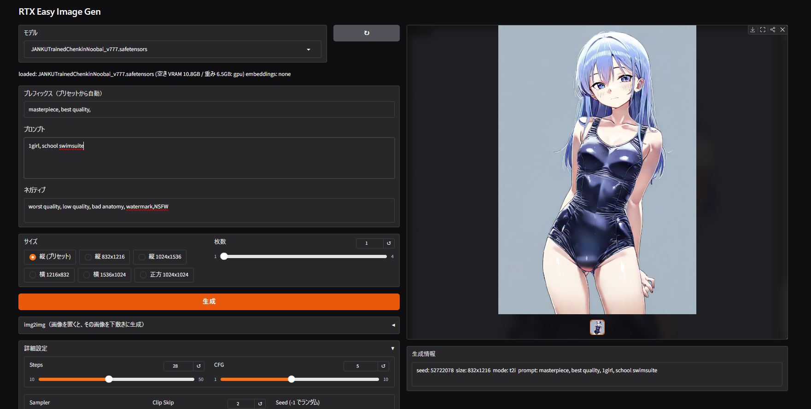

# RTX Easy Image Gen

diffusers ベースの SDXL / Illustrious 系画像生成ツール。ComfyUI もグローバル Python 環境も不要で、`setup.bat` → `start.bat` の2手で動きます。txt2img / img2img 対応。



左が操作パネル、右が生成結果。モデルを選ぶとプリセットが自動で入るので、プロンプトを書いて **生成** を押すだけです。

## 動作環境

| | |
| --- | --- |
| GPU | NVIDIA GeForce **RTX 40 シリーズ / 50 シリーズ** |
| VRAM | 8GB から動作（12GB 以上を推奨） |
| OS | Windows |

`setup.bat` が入れる torch は CUDA 12.8 ビルドで、RTX 40 系（Ada）・50 系（Blackwell）の両方をカバーします。50 系は CUDA 12.8 でないと動かないため、40 系ユーザーも同じ手順でそのまま構いません。

モデルをロードする前に、そのチェックポイントが VRAM に載るかを自動で判定します（詳細は [7. VRAM 判定](#7-vram-判定)）。8GB カードでも標準的な SDXL は CPU オフロードで動きます。

---

## 1. 初回セットアップ

1. `setup.bat` をダブルクリック。

   中でやっていること：
   - `uv` が無ければユーザー領域へ自動インストール（管理者権限不要）
   - プロジェクト専用の Python 3.12 を取得
   - `.venv` を作成
   - torch / torchvision を **CUDA 12.8 ビルド**でインストール（RTX 40 / 50 系の両対応）
   - `requirements.txt` の残りをインストール

2. 最後に GPU 認識結果が表示されます。

   ```
   CUDA: True / NVIDIA GeForce RTX 4070
   ```

   `CUDA: False` の場合は [トラブルシューティング](#8-トラブルシューティング) を参照。

システムに元から入っている Python には一切触りません。やり直したくなったら `.venv` フォルダを削除して `setup.bat` を再実行するだけです。

## 2. モデルを置く

いちばん手軽なのは、起動後に **「モデルを追加」タブから Civitai を検索して落とす**方法です（[2-1](#2-1-civitai-から追加する画面から)）。手元にある `.safetensors` を使う場合は、以下のフォルダに直接置いても構いません。

| 置き場所 | 中身 |
| --- | --- |
| `models/checkpoints/` | SDXL / Illustrious 系のチェックポイント（`.safetensors`） |
| `models/embeddings/` | Textual Inversion 埋め込み（`.safetensors`、SDXL 形式のみ） |

- チェックポイントは **単一ファイルの `.safetensors`** のみ対応（diffusers 形式のフォルダ配布は非対応）。
- embedding は **ファイル名がそのままトリガーワード**になります。`lazyneg.safetensors` を置けば、プロンプトに `lazyneg` と書くだけで効きます。
- embedding は SDXL 形式（内部に `clip_l` と `clip_g` の両方を持つもの）である必要があります。SD1.5 用のものは起動時のコンソールに `[skip] ...` と出て無視されます。
- モデルと生成画像は `.gitignore` 済みで git 管理外です。

### 2-1. Civitai から追加する（画面から）

**「モデルを追加」タブ**でモデル名を検索し、サムネイルから選んで **ダウンロード** を押すだけです。落としたモデルは `models/checkpoints/` に保存され、そのまま「モデル」ドロップダウンに現れます。

検索結果には **SDXL / Illustrious / Pony / NoobAI 系だけ**が出ます。このツールは SDXL 専用のため、SD1.5 や Flux を落としてもロードできないので、検索の段階で除外しています。

#### API キーの設定（初回のみ）

Civitai はダウンロードに API キーを要求します（未設定だと落とせません）。

1. [civitai.com](https://civitai.com) にログイン
2. 右上のアイコン → **Account settings** → **API Keys** → **Add API key**
3. 表示されたキーを「モデルを追加」タブの **API キー** 欄に貼って **保存**

キーは `config.local.json` に保存されます。このファイルは `.gitignore` 済みなので、リポジトリを公開しても漏れません。

#### 知っておくと安心なこと

- **中断しても続きから再開できます。** ダウンロード中のファイルは `.part` という名前で保存され、完全に落ちきってから `.safetensors` に変わります。途中で失敗した場合はもう一度ボタンを押せば続きから再開し、中途半端なファイルがモデル一覧に出ることはありません。
- 開始前にディスクの空き容量を確認し、足りなければその場で止めます。
- 同名のファイルが既にあれば再ダウンロードしません。
- Civitai の検索 API は時々 503 を返しますが、自動でリトライします。それでも駄目なときは少し待ってからもう一度検索してください。
- 早期アクセスや購入が必要なモデルは検索結果に出ません（落とせないため）。

## 3. 起動する

`start.bat` をダブルクリック。ブラウザが自動で開きます。

閉じるときはブラウザのタブではなく、**コンソールウィンドウを Ctrl+C または閉じる**で終了してください。

## 4. 画面の使い方

画面は **「生成」** と **「モデルを追加」** の2タブ構成です。以下は生成タブの説明です（モデル追加は [2-1](#2-1-civitai-から追加する画面から)）。

### 基本の流れ

1. **モデル** ドロップダウンから選ぶ
   → 選んだ瞬間にモデルがロードされ、そのモデル用のプリセット（推奨設定）が各欄に自動で入ります。初回ロードは数十秒かかります。

   ロードが終わるとドロップダウンの下にステータスが出ます。

   ```
   loaded: JANKU v7.777.safetensors (空き VRAM 10.8GB / 重み 6.5GB: gpu) embeddings: lazyneg, lazypos
   ```

   括弧内が動作モードです。`gpu` はモデルを VRAM に常駐（高速）、`cpu offload` は 8GB 級カード向けの逐次転送モード（低速だが省 VRAM）。判定に使うのは GPU の総容量ではなく**そのときの空き VRAM** なので、ゲームなど VRAM を使うアプリを起動したままだと `cpu offload` 側に倒れることがあります。
2. **プロンプト** に描きたいものを書く（例：`1girl, solo, looking at viewer`）
3. **生成** を押す
4. 生成中は数ステップごとに**途中経過のプレビュー**がギャラリーに流れます。構図が気に入らなければ **中止** を押せば残りのステップを払わずに済みます（途中の絵は保存されません）
5. 完成すると結果がギャラリーに表示され、`outputs/` へ自動保存されます

途中プレビューには軽量デコーダ（TAESDXL、約 10MB）を初回に一度だけ Hugging Face から取得して使います。オフラインなど取得できない環境では、色と構図だけ分かる簡易プレビューに自動で切り替わります。**プレビューは近似表示**なので、最終画像とは色味や細部が少し違います（最終画像の品質には一切影響しません）。

起動後にモデルを追加した場合は、ドロップダウン横の **↻** ボタンで一覧を再読み込みできます。

### 各項目

| 項目 | 説明 |
| --- | --- |
| **プレフィックス** | プロンプトの先頭に自動で足される品質タグ。プリセットから入りますが手で編集できます。実際に使われるのは `プレフィックス + プロンプト` を連結したものです。 |
| **プロンプト** | 本文。 |
| **ネガティブ** | 出したくない要素。プリセットから自動で入ります。 |
| **サイズ** | `縦 (プリセット)` を選ぶとプリセットの `size` が使われます。それ以外を選ぶと明示指定になります。 |
| **枚数** | 1〜4枚。2枚目以降は seed が `seed+1`, `seed+2`... と自動でずれます。 |

### プロンプトの書き方（Civitai と同じ記法が使えます）

**強調構文と長いプロンプトに対応しています。** Civitai やモデル配布ページに載っているプロンプトを、そのままコピーして貼り付けられます。

- **重み付け**: `(school swimsuit:1.3)` のように書くと、そのタグを強調（1.0 より大きい）／抑制（小さい）できます。`(tag)` は 1.1 倍、`[tag]` は 0.9 倍の短縮記法です。
- **77 トークン超**: CLIP の上限を超えるプロンプトは自動で分割して全部渡されます。後半に書いた画風タグや絵師タグが切り捨てられることはありません。

タグ名そのものに含まれる括弧はエスケープが必要です（例：`fate \(series\)`）。タグ補完から挿入すれば自動でエスケープされます。

> Clip Skip 以外を既定のまま使う場合、この記法は **Clip Skip 2** のときに有効です。1 や 3 を選んだときは通常解釈になり、強調構文は文字として扱われます。

### プロンプトのタグ補完

**プロンプト欄・ネガティブ欄で入力すると、Danbooru タグの候補がポップアップします。** 投稿数の多い順に並び、`↑` `↓` で選んで `Enter`（または `Tab`）で挿入、`Esc` で閉じます。クリックでも選べます。

- タグは挿入時にアンダースコアが空白に変換され（`school_uniform` → `school uniform`）、括弧は自動でエスケープされます（`fate_(series)` → `fate \(series\)`。素の括弧は強調構文と誤解釈されるため）。
- 候補は色分けされます（一般 / 版権 / キャラ / 絵師）。`models/embeddings/` に置いた embedding のトリガーワードも候補の先頭に出ます。
- 候補は同梱の `data/danbooru_tags.csv`（投稿数上位 2 万タグ）から出しており、**実行時にネットワークへは接続しません**。
- 辞書を更新したい場合（新しいキャラクター名などを取り込みたい場合）は `.venv\Scripts\python.exe build_tags.py` を実行すると Danbooru から取り直します。このファイルが無くても、補完が無効になるだけで生成には影響しません。

### 画像から生成する（img2img）

「img2img」アコーディオンに画像をドロップすると、その画像を下敷きにした生成に切り替わります。専用のボタンはなく、**画像が置いてあれば i2i、空なら通常の txt2img** です。生成情報欄の `mode:` でどちらで生成されたか確認できます。

| 項目 | 説明 |
| --- | --- |
| **入力画像** | PNG / JPEG など。透過 PNG は自動で RGB に変換されます。 |
| **変化の強さ** | 0.3〜0.45：構図を保ったまま塗り直し。0.5〜0.7：大きく描き直し。0.85〜1.0：元画像はほぼ参考程度。 |

i2i のときの挙動で知っておくべき点：

- **出力サイズは入力画像のアスペクト比に従います。**「サイズ」で選んだ解像度は画素数の目安として使われ、入力の縦横比を保ったまま同じ画素数（8の倍数）に丸められます。縦長の画像を入れて「横 1216x832」を選んでも横長にはなりません。
- **実際のステップ数は `Steps × 変化の強さ`** です（diffusers の仕様）。強さ 0.4 で Steps 30 なら 12 ステップしか回らないので、低い強さで粗いと感じたら Steps を上げてください。
- txt2img に戻すには入力画像の「×」で画像を消すだけです。

### 詳細設定（アコーディオン）

| 項目 | 説明 |
| --- | --- |
| **Steps** | サンプリング回数（10〜50）。多いほど緻密になりますが遅くなります。 |
| **CFG** | プロンプトへの忠実度（1〜10）。Illustrious 系は 4〜6 程度が扱いやすい。 |
| **Sampler** | `euler` / `euler_a` / `dpmpp_2m` / `dpmpp_2m_karras` の4種。 |
| **Clip Skip** | 1〜3。アニメ系モデルは 2 が定番。**A1111 / Civitai の表示と同じ意味**なので、モデル配布ページの推奨値をそのまま入れて構いません。 |
| **Seed** | `-1` でランダム。同じ絵を再現したいときは、生成情報に出た seed をここに入れて他の設定も揃えます。 |

### 生成情報

生成後に下の **生成情報** 欄へ、使われた seed・解像度・モード（t2i / i2i）・実際に投げられたプロンプト（プレフィックス連結後）が出ます。再現したいときはここを見てください。

2 行目には工程別の実測が毎回出ます。

```
[embed 0.05s | unet 9.10s | vae 0.41s | 0.33s/step | peak 9.8GB]
```

`embed` はテキストエンコード（同じプロンプトの 2 回目以降はキャッシュされ ≈0 になります）、`unet` が生成本体、`vae` が画像化、`peak` はこの生成での VRAM 予約ピークです。**`⚠ VRAM 上限付近` が出たら共有メモリ退避で激遅になる寸前**なので、枚数やサイズを下げるか他のアプリを閉じてください。速度の問題を報告・調査するときはこの行を見れば、どの工程が遅いのか一目で分かります。

なお、生成情報に出た seed を入れ直して同じ設定で再実行した場合は、**再計算せずに前回の結果を即座に返します**（定義上まったく同じ画像になるため）。

## 5. 保存先

`outputs/` に以下の名前で自動保存されます。

```
outputs/20260822_154812_123456789.png
        └─ 日時 ─┘ └─ seed ─┘
```

複数枚生成した場合は seed が1ずつ増えた名前で個別に保存されます。

保存は画面表示をブロックしないよう裏で行われるため、生成直後の一瞬はファイルがまだ書き込み中のことがあります。また PNG の圧縮率を速度優先（level 1）にしているので、ファイルサイズは従来より 1〜2 割大きくなります。

## 6. モデルごとの推奨設定（プリセット）

`presets/` に JSON を置くと、そのモデルを選んだときに自動で設定が入ります。

- ファイル名は **チェックポイントのファイル名から拡張子を除いたもの**
  例：`models/checkpoints/JANKU v7.777.safetensors` → `presets/JANKU v7.777.json`
- 該当ファイルが無ければ `presets/_default.json` が使われます
- 個別 JSON は `_default.json` に**上書きマージ**されるので、変えたいキーだけ書けば OK です

### 書式

```json
{
  "steps": 30,
  "cfg": 5.0,
  "sampler": "euler_a",
  "clip_skip": 2,
  "size": [1024, 1536],
  "prefix_pos": "lazypos, ",
  "default_neg": "lazyneg"
}
```

| キー | 意味 |
| --- | --- |
| `steps` | Steps の初期値 |
| `cfg` | CFG の初期値 |
| `sampler` | `euler` / `euler_a` / `dpmpp_2m` / `dpmpp_2m_karras` |
| `clip_skip` | Clip Skip の初期値 |
| `size` | `[幅, 高さ]`。「縦 (プリセット)」選択時に使われます |
| `prefix_pos` | プレフィックス欄に入る文字列（末尾のカンマ+スペースを忘れずに） |
| `default_neg` | ネガティブ欄に入る文字列 |

## 7. VRAM 判定

チェックポイントを実際に読み込む前に、safetensors のヘッダだけを覗いて **fp16 換算の重みサイズ**を実測し、**そのときの空き VRAM** と突き合わせて配置を決めます。重いロード処理に入る前に判定するので、載らないモデルは待たされずに弾かれます。

総容量ではなく空きを見るのは、Windows では VRAM が足りなくてもエラーにならず、あふれた分をシステムメモリへ黙って退避させるためです。この状態になると生成が数十倍遅くなり、進捗バーが 0 のまま止まったように見えます。空きで判定しておけば、その手前で `cpu offload` かエラーに倒れます。

| 状況 | 判定 | 挙動 |
| --- | --- | --- |
| `重み全体 + 作業領域` が VRAM に収まる | **gpu** | モデルを VRAM に常駐。高速。 |
| 収まらないが `UNet + 作業領域` なら収まる | **cpu offload** | UNet・テキストエンコーダ・VAE を1つずつ GPU へ出し入れ。低速だが動く。 |
| それも収まらない | **エラー** | ロードせず、必要量と実際の VRAM を表示して中止。 |

オフロードでも動くのは、同時に GPU へ載せるのが最大でも一番大きい単体モジュール（SDXL なら UNet 約 4.8GB）だけで済むためです。重み全体（約 6.5GB）を一度に載せる必要はありません。

標準的な SDXL での判定結果：

| GPU | 判定 |
| --- | --- |
| RTX 4060 / 4060 Ti 8GB | cpu offload |
| RTX 4070 12GB 以上、4080、4090、50 系 | gpu |

つまり **RTX 40 / 50 シリーズであれば、標準的な SDXL でエラーになることはありません**。エラー判定は、極端に大きいモデルや SDXL 以外の巨大なチェックポイントを置いてしまったときの保険です。

### 調整したい場合

`engine.py` の 2 つの定数で挙動を変えられます。

| 定数 | 既定 | 意味 |
| --- | --- | --- |
| `ACTIVATION_HEADROOM_GB` | 2.5 | GPU 常駐に必要な作業用 VRAM の見積り。下げれば常駐しやすくなるが、生成中に OOM しやすくなる。 |
| `OFFLOAD_HEADROOM_GB` | 1.5 | オフロード可否の判定に使う作業領域。タイル分割デコード前提なので常駐時より小さい。8GB カードでロードを弾かれる場合はここを下げる。 |
| `LOW_VRAM_GB` | 10 | ヘッダを解釈できず重みを見積れなかったときだけ使うフォールバック閾値。 |

エラーになるが「実際には動くはず」と分かっている場合は `ACTIVATION_HEADROOM_GB` を下げてください。逆に生成中の OOM が頻発するなら上げます。

## 8. トラブルシューティング

**`CUDA: False` と出る / 生成時に CUDA エラー**
CUDA 12.8 ビルドの torch が入っているか確認してください。`.venv` を削除して `setup.bat` を再実行すれば入り直します。NVIDIA ドライバが古い場合も更新が必要です（RTX 50 系は CUDA 12.8 対応ドライバが必須）。

**モデル一覧が空**
`models/checkpoints/` に `.safetensors` が入っているか確認し、**↻** を押してください。「モデルを追加」タブから落とすこともできます（[2-1](#2-1-civitai-から追加する画面から)）。

**モデルをダウンロードできない**
「API キーが未設定です」と出る場合は [2-1](#2-1-civitai-から追加する画面から) の手順でキーを設定してください。401 は失効か入力ミス、403 は早期アクセス等でそのアカウントに配布されていないモデルです。通信が切れた場合は、もう一度ボタンを押せば続きから再開します。

**embedding が効かない**
起動したコンソールに `[skip] ファイル名: SDXL 形式 (clip_l/clip_g) ではありません` が出ていないか確認してください。SD1.5 用の embedding は SDXL では使えません。読み込みに失敗した場合は `[warn]` が出ます。

**VRAM 不足で落ちる**
空き VRAM が足りない GPU では自動で CPU オフロードに切り替わり、さらに VAE のタイル処理でデコード時のメモリ消費も抑えてあります。それでも足りない場合は、枚数を 1 に、サイズを `縦 832x1216` に下げてください。8GB カードで 1024x1536 の複数枚生成はかなり厳しいと考えてください。

**「VRAM が足りないため ... は読み込めません」と出る**
そのチェックポイントは、CPU オフロードを使っても VRAM に載りません。エラーには必要量と実際の VRAM が出るので確認してください。より小さいモデルを使うか、見積りが厳しすぎると判断できる場合は `OFFLOAD_HEADROOM_GB` を下げます（[7. VRAM 判定](#7-vram-判定)）。

**生成が異常に遅い**
まずステータスが `cpu offload` になっていないか確認してください。このモードは推論のたびに重みを CPU↔GPU 間で転送するため、GPU 常駐に比べて明確に遅くなります。VRAM に余裕があるのにオフロードされている場合は `ACTIVATION_HEADROOM_GB` を下げると常駐に切り替わることがあります（[7. VRAM 判定](#7-vram-判定)）。

`gpu` なのに遅い、特に**進捗バーが 0 のまま何分も動かない**場合は、VRAM があふれてシステムメモリに退避している可能性が高いです。GPU 使用率は 100% に見えるのに消費電力が上がらない（アイドル相当のまま）のが目印で、タスクマネージャーの「GPU メモリ」で*共有*側に数 GB 乗っていれば確定です。生成中は VRAM を使う他のアプリ（ゲーム、配信・録画ソフト）を閉じてください。

**`.venv がありません` と言われる**
先に `setup.bat` を実行してください。

**速度設定（旧 `SPEED_TWEAKS`）について**
かつて 1 つの定数に束ねていた速度設定は、`engine.py` で **4 つの独立したフラグ**に分かれました。RTX 5070 で実測された 55 倍の悪化（0.9 秒/step → 51 秒/step）の犯人は QKV 融合の VRAM +1.2GB だけで、他の 3 つはメモリを増やさないのに巻き添えで無効化されていたためです。

| フラグ | 既定 | 説明 |
| --- | --- | --- |
| `USE_TF32` | True | fp32 演算の高速化。メモリ増なし |
| `USE_CHANNELS_LAST` | True | Tensor Core が効きやすいメモリ配置。メモリ増ほぼなし |
| `USE_CUDNN_BENCHMARK` | True | 解像度固定の使い方と好相性。初回のみカーネル探索 |
| `USE_FUSE_QKV` | **False** | +約1.2GB。12GB では溢れて逆効果（上記実測）。16GB 以上専用 |

有効なフラグがあるとビット単位の再現性は保証されません（見た目に分かる差はまず出ません）。厳密な再現が要るときは上 3 つも False にしてください。

**高速化の変更で絵が変わっていないか確かめたい**
`tools\quality_check.py` が固定 seed × 固定プロンプトで生成して前後比較します。変更前に `... quality_check.py baseline`、変更後に `... quality_check.py after --compare baseline`。LPIPS < 0.05 なら実質同一です。

**モデル切り替えが重い**
切り替え時に前のモデルを解放して VRAM を空けてから新しいモデルをロードしているため、毎回ロード時間がかかります。同じモデルを再選択した場合はロードをスキップします。

## ライセンス

[MIT License](LICENSE) — Copyright (c) 2026 Nozomu

本ツール自体のライセンスであり、**生成した画像やダウンロードしたモデルには適用されません**。チェックポイントや embedding には配布元それぞれの利用規約（商用利用の可否、クレジット表記など）があるので、そちらを確認してください。
